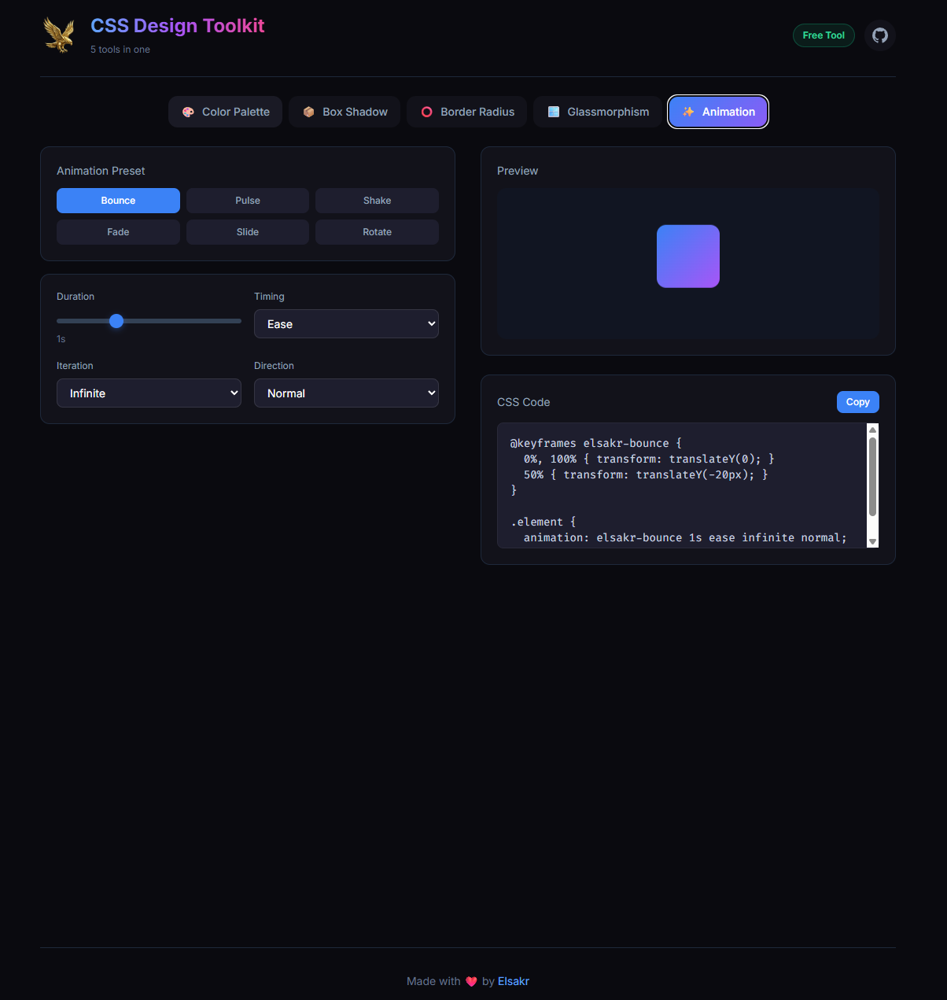

# 🦅 Elsakr CSS Design Toolkit

<div align="center">
  <a href="https://elsakr.company">
    
  </a>
</div>

> **Part of Elsakr Open Source Tools Ecosystem — [View All Tools](https://elsakr.company/tools)**  
> *5 CSS Tools in ONE Toolkit. The Swiss Army Knife for Web Design.*

---

## ⭐ Badges


## 📋 Table of Contents
- [🦅 Elsakr CSS Design Toolkit](#-elsakr-css-design-toolkit)
  - [⭐ Badges](#-badges)
  - [📋 Table of Contents](#-table-of-contents)
  - [🧐 What is it?](#-what-is-it)
  - [✨ Features](#-features)
  - [🚀 Installation \& Usage](#-installation--usage)
  - [🤝 Contributing](#-contributing)
  - [📜 License](#-license)
  - [📞 Contact](#-contact)
  - [🇪🇬 Arabic Version / النسخة العربية](#-arabic-version--النسخة-العربية)

---

## 🧐 What is it?
**Elsakr CSS Design Toolkit** is a comprehensive collection of small utilities for web components. It includes generators for Box Shadows, Border Radius (Fancy Blob shapes), Glassmorphism effects, Colors, and basic Animations. All integrated into one simple dashboard.

## ✨ Features
- **Box Shadow**: Generates layered smooth shadows.
- **Border Radius**: Create organic "blob" shapes with code.
- **Glassmorphism**: The frosted glass effect generator.
- **Color Picker**: HSL/RGB/HEX converter.
- **Animations**: CSS Keyframe library.

## 🚀 Installation & Usage


1. **Clone**:
   ```bash
   git clone https://github.com/khalidsakrjoker/Elsakr-CSS-Design-Toolkit.git
   ```
2. **Run**: Open `index.html`.
3. **Experiment**: Switch between tabs to use different tools.

---

## 🤝 Contributing
Feel free to add more tools (e.g., Grid Generator) via Pull Requests.

## 📜 License
Distributed under the MIT License. See `LICENSE` for more information.

## 📞 Contact
**Elsakr Tools** - [elsakr.company](https://elsakr.company)  
*Open Source Tools with a Falcon’s Vision.*

---

# 🇪🇬 Arabic Version / النسخة العربية

# 🦅 Elsakr CSS Design Toolkit (حقيبة المصمم)

<div align="center">
  <a href="https://elsakr.company">
    
  </a>
</div>

> **جزء من نظام صقر للأدوات مفتوحة المصدر — [عرض كل الأدوات](https://elsakr.company/tools)**  
> *5 أدوات CSS في مكان واحد. السويس نايف (السكينة السويسرية) لتصميم الويب.*

---

## 🧐 ما هي هذه الأداة؟
مجموعة شاملة من الأدوات الصغيرة لمكونات الويب. بتضم مولدات لـ الظلال (Box Shadows)، انحناء الحواف (تشكيل الـ Blobs)، تأثير الزجاج (Glassmorphism)، محول ألوان، ومكتبة أنيميشن بسيطة. كل ده في لوحة تحكم واحدة.

## ✨ المميزات
- **الظلال**: توليد ظلال ناعمة وطبقات متعددة.
- **الحواف**: عمل أشكال "Blobs" عضوية بالكود.
- **تأثير الزجاج**: مولد Glassmorphism االشهير.
- **الألوان**: تحويل بين HSL/RGB/HEX.
- **الأنيميشن**: مكتبة حركات CSS جاهزة.

## 🚀 التثبيت والاستخدام
1. **نزل الملفات**: اعمل Clone للريبو.
2. **شغل**: افتح `index.html`.
3. **جرب**: تنقل بين التبويبات واستخدم الأدوات المختلفة.

## 📞 تواصل معنا
**أدوات صقر** - [elsakr.company](https://elsakr.company)  
*أدوات مفتوحة المصدر برؤية صقر.*
